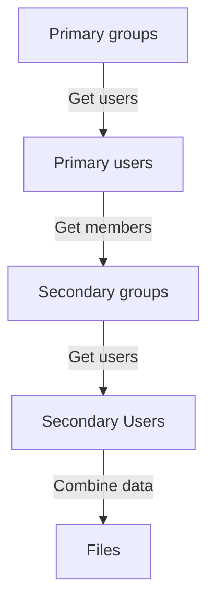
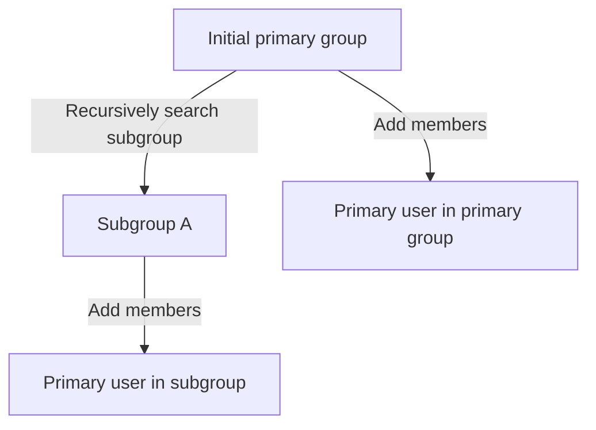
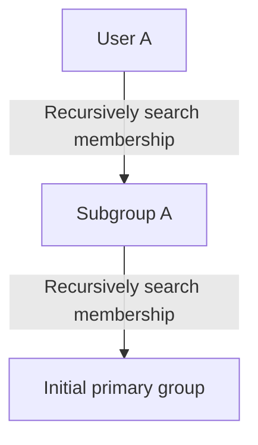

# ldap2files

This is a small-ish script that copies information from a
primary Active Directory (AD) source into either LDIF files
for AD / LDAP import or Unix passwd/group files.

## Working principle

What the script does is the following:
1. It will connect to AD via LDAP.
2. Based on the group names given it will find information on these groups. These groups
   are called primary groups as we're interested in users that belong to these groups.
3. Script will then find users that belong to primary groups. These are called primary
   users.
4. Script will then find groups that primary users are members of. These are called
   secondary groups.
5. Optionally, script will also find information on users that belong to these secondary
   groups (only when `--secondary-users` is specified).
6. After all of this information has been gathered, the combined information will be written
   as LDIF or Unix passwd/group files.

As a graph, this can be represented as follows:



### Recursive groups

Sometimes the primary group has subgroups. Then one cannot simply get memberships by looking
at the members of the primary group. There are two strategises that the script can use to
search these recursive groups: groupwise and memberwise.

#### groupwise recursive search

In groupwise recursive search any groups that belong to the primary groups will be recursively
searched for other groups and their members. Any subgroups that belong to the initial primary
group will be marked as primary groups and their users as primary users.



#### memberwise recursive search

In memberwise recursive search the script uses an LDAP query
`memberOf:1.2.840.113556.1.4.1941:=GROUP_DN` for doing a recursive check on which users
belong to the primary group. This is slower as the query needs to be done to the whole
AD space and if the group has a lot of members the query can grow too big. However,
it might reflect the group structure more accurately. The recommendation is that you
run a memberwise query and groupwise query and check if the outputs match.



### Minimizing queries

All queries are grouped based on the searched user's/group's OU bases.
So for example, if user A and user B belong to the same OU base
(e.g. OU=users,DC=org,DC=example,DC=com), they will be queried at the same
time using an LDAP filter with an or-statement (`|(CN=userA)(CN=userB)`).
This dramatically reduces the number of queries if users/groups belong to
common organizational units.

Each query has a default of 100 or-statements so that a single query will
not grow too large.

## Requirements

This script requires the following Python packages:
- [python-ldap](https://www.python-ldap.org/)
- [click](https://click.palletsprojects.com/)
- [PyYAML](https://pyyaml.org)

An example conda environment is in `environment.yml`.

## Usage

Flags can be printed via `python ldap2files.py --help`:

```sh
$ python ldap2files.py --help
Usage: ldap2files.py [OPTIONS]

Options:
  --config FILE                   Configuration file to use
  --groups TEXT                   Groups to search from LDAP (comma separated
                                  list)  [required]
  --server TEXT                   AD server  [required]
  --user-base TEXT                Group search base  [required]
  --group-base TEXT               Group search base  [required]
  --extra-user-attrs TEXT         Extra user attributes
  --extra-group-attrs TEXT        Extra group attributes to search
  --auth-type [bind|gssapi]       Authentication type
  --cert PATH                     Path to certificates
  --user TEXT                     Username (only valid for bind auths)
  --password TEXT                 Password (only valid for bind auths)
  --primary-user-gid TEXT         Primary GID for users (only valid for files)
  --recursive-primary / --no-recursive-primary
                                  Whether primary group search should be
                                  recurive or not
  --recursive-strategy [groupwise|memberwise]
                                  Which recursive strategy to use when doing
                                  the search: recursively from primary groups
                                  members or from memberOf-attribute
  --secondary-users / --primary-users-only
                                  Whether primary group search should be
                                  recurive or not
  --cache-primary / --no-cache-primary
                                  Cache primary group members
  --cache-primary-users-names / --no-cache-primary-users-names
                                  Cache primary group users' names
  --cache-primary-users / --no-cache-primary-users
                                  Cache primary group users
  --cache-secondary / --no-cache-secondary
                                  Cache secondary group members
  --cache-secondary-users / --no-cache-secondary-users
                                  Cache secondary group users
  --cache-all / --no-cache-all    Cache all steps
  --loglevel [debug|info|warning]
  --output-format [files|ldif]    Output file type
  --output-prefix TEXT            Output file name prefix
  --sort-ldif / --no-sort-ldif    Sort LDIF group memberships (for LDIF
                                  output)
  --validation-standard [shadow-utils|rhel|ubuntu]
                                  Validation standard for user and group names
                                  (for files output)
  --max-query-size INTEGER        Validation standard for user and group names
                                  (for files output)
  --user-overrides TEXT           User overrides (JSON dictionary format)
  --group-overrides TEXT          Group overrides (JSON dictionary format)
  --user-defaults TEXT            User defaults if attributes are missing
                                  (JSON dictionary format)
  --group-defaults TEXT           Group defaults if attributes are missing
                                  (JSON dictionary format)
  --help                          Show this message and exit.
```

All of the flags can also be given in a configuration yaml that can be
given via the `--config`-option. Command line arguments will have preference
over configuration file arguments. Dashes in the command line parameters are
written as underscores in the configuration file (e.g. `--user-base X` from
the command line and `user_base: X` would work the same).

Example configuration file:
```yml
groups: my_primary_group
server: dc=org,dc=example,dc=com
user_base: ou=users,ou=root,dc=org,dc=example,dc=com
group_base: ou=groups,ou=root,dc=org,dc=example,dc=com
cert: '/etc/ssl/certs/ca-certificates.crt'
extra_user_attrs: 'unixHomeDirectory,loginShell'
extra_group_attrs: ''
user_overrides:
  unixHomeDirectory: "/home/{sAMAccountName}"
group_overrides: {}
```

`user_defaults`, `group_defaults`, `user_overrides` and `group_overrides`
that expect dictionaries can be specified from the command line with JSON
dictonary syntax.
